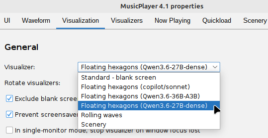
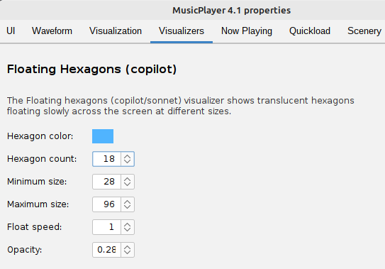
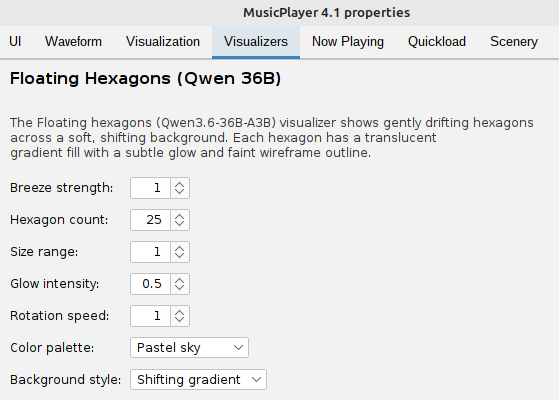
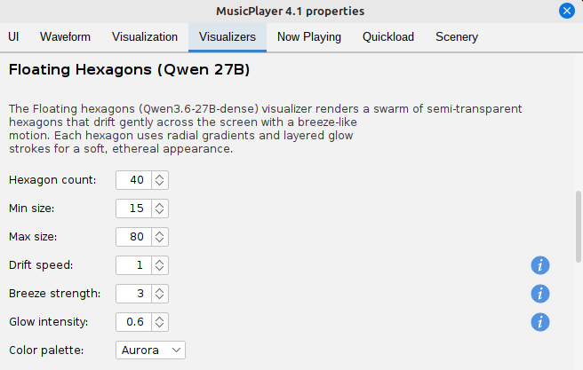

# ext-mp-ai-visualizers

This is a collection of full-screen visualizers for the [MusicPlayer](https://github.com/scorbo2/musicplayer/)
application.
All of these visualizers were generated by AI code assistants as part of an experiment for YouTube.
(TODO link the video here when it's published.)

## Summary of visualizers

All AI assistants were given the same prompt, to keep things fair:

```
Build a new full-screen visualizer that shows floating hexagons gently moving across the screen.
It should have a light and airy feeling to it, as though the hexagons are being moved by a gentle breeze.
Try to be creative with the display - avoid solid-color backgrounds and simple polygons. Use gradients,
transparency, glow effects, or any other techniques you can think of to make it more visually interesting.
Optionally, you can expose configuration options to the user so the movement or appearance of the hexagons
can be adjusted.
```

## The results in brief

- GitHub Copilot (Sonnet 4.6) - baseline pass, just to give us a reference implementation. Reasonably good, but a little
  boring.
- Qwen 3.6 35B A3B - a decent but visually uninteresting implementation.
- Qwen 3.6 27B dense - surprisingly good! The hexagons slowly rotate as they move, and they have a nice look to them.
- Gemma4 12B dense - was unable to complete its implementation.
- Gemma4 31B dense - ran extremely slowly and took down the server (out of memory most likely).
- Gemma4 26B A4B - was unable to complete its implementation.

The Gemma4 results are particularly disappointing, but probably hardware-related. We're running with a pretty
good GPU in a really old machine.

Update: after filming the video, I asked the GrizzledSeniorDev code review agent to take a look at the results
and rank them. The results were a bit surprising: [ResultsComparison.md](ResultsComparison.md)

## Running the results locally

### Option 1: automatic install via ExtensionManager

If you have [MusicPlayer](https://github.com/scorbo2/musicplayer/) 4.x installed, you can just visit the extension
manager dialog, select the
"Available" tab, and install the "AI visualizers" extension from there. The extension manager will download
the extension jar and place it in your MusicPlayer extensions directory for you. You will be prompted to restart.
This is the easiest option.

### Option 2: build from source

Requirements: Maven, Java 25

You'll need to have already built and installed MusicPlayer 4.x into your local Maven repository.
Once you have done that, you can just clone this repo, build the extension, and deploy it manually:

```bash
git clone https://github.com/scorbo2/ext-mp-ai-visualizers.git
cd ext-mp-ai-visualizers

# Note: you need MusicPlayer-4.x in your local maven repo for this to work:
mvn package

# Copy the extension jar to your MusicPlayer extensions directory:
cp target/ext-mp-ai-visualizers*.jar ~/.MusicPlayer/extensions/
```

Now restart MusicPlayer if it was running, and you should see the new visualizers available
in the "Visualization" tab of the application properties dialog. Select any of them, hit "OK",
and then select the full screen button (or hit "v") to enter full-screen mode.

## The results in detail

To select one of these visualizers after installing this extension, open the application properties
dialog, select the "Visualization" tab, and then select one of the items from the "Visualizer" list shown below:



### GitHub Copilot (Sonnet 4.6)

Copilot's offering built the following configuration properties:



The results:

<a href="docs/results_copilot.jpg">
  
</a>

The hexagons are simple single-color polygons with varying transparency, which is a bit boring.
But, they change direction as they move and have a slight intentional "wobble" to them. Also, the background
features a subtle radial gradient which slowly moves, which is a nice touch.

### Qwen 3.6 35B A3B

Qwen's offering built the following configuration properties:



The results:

<a href="docs/results_qwen36.jpg">
  
</a>

This version offers the most configuration options, including multiple background types. However, after playing
with it for a while, it seems the background effect is so subtle that it basically appears to be a solid color,
which is very boring. There are color options for the hexagons, and they also come with a "glow" effect and
a radial fill, which is kind of nice.

### Qwen 3.6 27B dense

Qwen's 3.6 offering built the following configuration properties:



The results:

<a href="docs/results_qwen37.jpg">
  
</a>

This is my personal favorite. These hexagons also have a radial fill and a "glow" effect, similar to
Qwen 35B's offering, but these hexagons slowly rotate as they move. The background features a very subtle
radial gradient that slowly moves, and gives the whole thing a really nice feel to it.

## License

MusicPlayer and this extension are made available under the MIT license: https://opensource.org/license/mit
